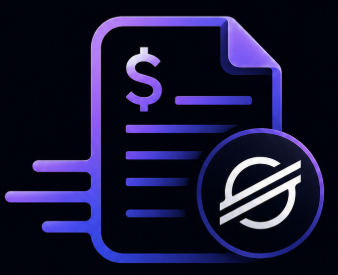
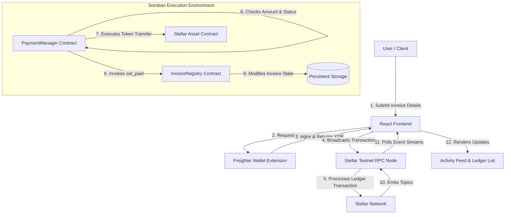
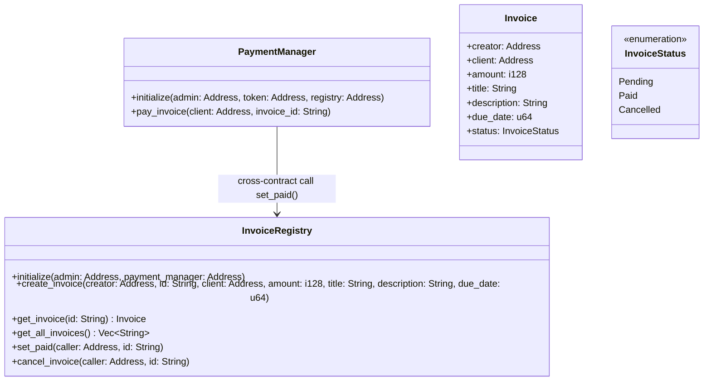
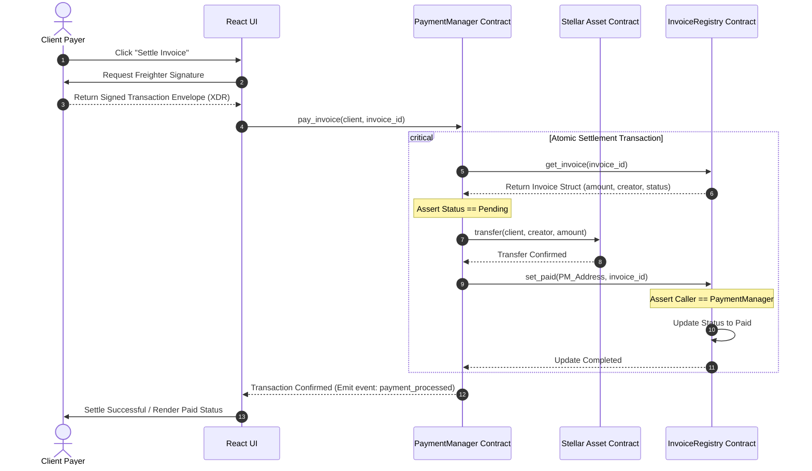
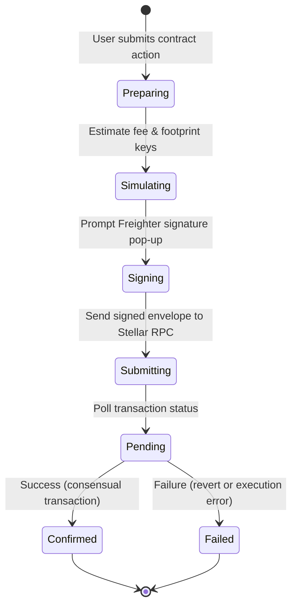

# InvoiceX: Create. Send. Get Paid. On Stellar.

<div align="center">
  
</div>

<div align="center">
  <h3>Decentralized Billing & Escrow Settlement Protocol on Soroban</h3>
  <p>A Web3 invoicing and instant-payment routing protocol providing zero-trust billing, immutable record verification, and atomic contract-to-contract settlements on the Stellar Network.</p>
</div>

<div align="center">
  
[](https://stellar.org)
[](https://stellar.org/developers)
[](https://react.dev)
[](https://www.typescriptlang.org)
[](https://vite.dev)
[](https://invoice-x-six.vercel.app/)
[](https://github.com/daman-21-deep/InvoiceX/actions)
[](LICENSE)

</div>

<div align="center" style="margin-top: 15px; margin-bottom: 30px;">
  <a href="https://invoice-x-six.vercel.app/" target="_blank" style="background-color: #000; color: #fff; padding: 12px 24px; font-weight: bold; border-radius: 8px; text-decoration: none; border: 2px solid #5a5a5a; box-shadow: 0 4px 15px rgba(0,0,0,0.5);">
    🚀 Launch Live App
  </a>
</div>

---

## 📖 TABLE OF CONTENTS
1. [Project Overview](#-project-overview)
2. [Problem Statement](#-problem-statement)
3. [Solution](#-solution)
4. [Live Demo & Testing Guide](#-live-demo--testing-guide)
5. [Demo Video](#-demo-video)
6. [Key Features Matrix](#-key-features-matrix)
7. [Stellar Level Compliance (1-4)](#-stellar-level-compliance-1-4)
8. [System Architecture](#-system-architecture)
9. [Smart Contract Architecture](#-smart-contract-architecture)
10. [Inter-Contract Communication](#-inter-contract-communication)
11. [Transaction Lifecycle](#-transaction-lifecycle)
12. [Event Streaming & Feed Synchronization](#-event-streaming--feed-synchronization)
13. [Tech Stack](#-tech-stack)
14. [Folder Structure](#-folder-structure)
15. [Installation & Local Setup](#-installation--local-setup)
16. [Environment Variables](#-environment-variables)
17. [Smart Contract Deployment](#-smart-contract-deployment)
18. [Contract Addresses](#-contract-addresses)
19. [Transaction Hashes](#-transaction-hashes)
20. [Explorer Links](#-explorer-links)
21. [Testing Suite](#-testing-suite)
22. [CI/CD Pipelines](#-cicd-pipelines)
23. [Security Architecture](#-security-architecture)
24. [Responsive UI Design](#-responsive-ui-design)
25. [User Testing & Validation](#-user-testing--validation)
26. [Telemetry, Analytics & Monitoring](#-telemetry-analytics--monitoring)
27. [Roadmap](#-roadmap)
28. [Future Features](#-future-features)
29. [Deployment](#-deployment)
30. [Contributing Guidelines](#-contributing-guidelines)
31. [License](#-license)
32. [Author & Contact](#-author--contact)
33. [Visual Screen Gallery](#-visual-screen-gallery)

---

## 🌟 PROJECT OVERVIEW

### What is InvoiceX?
**InvoiceX** is a decentralized, non-custodial invoice registry and instant payment settlement system built on top of the Stellar Network and powered by Soroban smart contracts. It bridges traditional invoicing workflows with cryptographic payment networks, allowing developers, creators, freelancers, and businesses to deploy on-chain invoices, receive native token payments via atomic contracts, and track billing states trustlessly.

### Why It Was Built
Digital invoicing today is broken. Standard billing templates rely on manual, centralized registries (Excel, QuickBooks, or centralized web portals) that are decoupled from actual settlement rails (wire transfers, credit cards, or external payment gateways). InvoiceX was built to resolve this disconnection, bundling the billing record and the payment mechanism into a single, cohesive, smart-contract-backed ledger state.

### Who It Helps
* **Freelancers & Contractors**: Instantly issue proof-of-work billing with cryptographic verification of client payment.
* **Global Businesses**: Avoid high intermediary fees (credit card processors, international wire charges) and achieve sub-second finality.
* **On-Chain Entities (DAOs, Web3 Projects)**: Systematically pay invoices via multi-sig or smart contracts using secure, public, auditable ledger states.

### Why Blockchain?
A public blockchain guarantees that invoicing agreements cannot be tampered with or deleted retroactively. It introduces decentralized access control, letting payers and creators directly interact without reliance on centralized, vulnerable SaaS database platforms.

### Why Stellar & Soroban?
* **Sub-Second Settlement**: Transactions finalize in ~5 seconds, matching or beating the speed of traditional payment gateways.
* **Fractions of a Cent Fees**: Execution cost is negligible, allowing micro-invoicing and high-frequency billing.
* **Soroban WASM Environment**: Turing-complete, high-performance WASM execution environment allows us to build state machine contracts with rigorous type checking, secure key validation, and state storage controls.

---

## ⚠️ PROBLEM STATEMENT

Invoicing is the backbone of global commerce, yet digital systems suffer from persistent points of failure:
1. **Payment Disputes**: Disagreements on whether a payment was initiated, the exact execution time, or whether the correct amount reached the contractor's bank.
2. **Fake Payment Screenshots**: Malicious clients generate fake PDF payment receipts or modified screenshots, claiming funds were sent to bypass delivery holds.
3. **Manual Verification & Matching**: Accountants manually check bank accounts to match incoming wires with open invoice records, wasting hundreds of hours.
4. **Settlement Delays**: International bank transfers and merchant processing gateways route payments through multiple correspondent banks, holding funds for 3 to 7 business days.
5. **Centralized Platform Vulnerabilities**: Invoicing systems store private financial records, email details, and payment histories in centralized cloud databases that are single points of failure for hacking and data leaks.
6. **Lack of Transparency**: Clients cannot track the transaction routing of their payments, and developers cannot programmatically build dependencies based on the settlement state.

---

## 💡 THE SOLUTION

InvoiceX addresses the broken invoicing lifecycle by introducing a dual-contract on-chain architecture:

```
  Traditional:   [Invoice Doc] --(Decoupled Banks/Wires)--> [Manual Matching]
  
  InvoiceX:      [On-Chain Invoice] =====(Atomic Soroban Payment)=====> [Auto-Settled Registry]
```

* **On-Chain Invoices**: Invoices are represented as immutable struct entries stored in the `InvoiceRegistry` contract, identifying the sender, recipient, amount, due date, and invoice ID.
* **On-Chain Payment Verification**: Payments are processed through the `PaymentManager` contract, which handles the token transfer and registry status update atomically.
* **Immutable State Transitions**: An invoice state transition from `Pending` ➔ `Paid` or `Cancelled` is secured by smart contract logic, eliminating chargebacks and fake receipts.
* **Cryptographic Event Streams**: State changes emit explicit Soroban event topics (`invoice_created`, `invoice_paid`, etc.), enabling instantaneous UI synchronization and external service hooks.

---

## 🚀 LIVE DEMO & TESTING GUIDE

**Live Application URL**: [https://invoice-x-six.vercel.app/](https://invoice-x-six.vercel.app/)

To allow judges, developers, and users to test the full lifecycle, InvoiceX features a **dual-mode gateway**:

### Option A: Simulator Sandbox (Zero Configuration)
1. Launch the live demo.
2. In the top-right header, ensure the **Network Selector** is set to `Simulator`.
3. The application will initialize with simulated wallet addresses and pre-configured mockup data loaded from LocalStorage.
4. You can create invoices, cancel them, and pay them instantly. All contract states, activity logs, and transactions are processed by an in-memory client engine replicating Soroban ledger events.

### Option B: Stellar Testnet Mode (Real On-Chain Integration)
1. Install the [Freighter Wallet Browser Extension](https://www.freighter.app/).
2. In Freighter settings, switch your active network to **Testnet**.
3. Toggle the network selector in the InvoiceX header to `Stellar Testnet`.
4. Click **Connect Wallet** in the top-right corner.
5. If your connected account has no funds, click the **Fund Wallet (Claim 1k XLM)** button to request Testnet funds from the Stellar Friendbot faucet.
6. **Deploy an Invoice**:
   * Navigate to the **Create** tab.
   * Input a client address (e.g., another Testnet address or create a temporary one).
   * Specify the XLM amount, title, and due date.
   * Click **Deploy Invoice** and approve the Freighter pop-up transaction signature request.
7. **Settle an Invoice**:
   * In the **Ledger** view, select your pending invoice.
   * Connect with the designated Client wallet address.
   * Click the **Settle Invoice** button and confirm the transaction signature to watch the atomic payment process execute on-chain.

---

## 🎥 DEMO VIDEO

Watch a complete product walkthrough of the InvoiceX platform showing the dual-mode gateway (Simulator & Stellar Testnet), smart contract deployments, and escrow payment lifecycle:

[InvoiceX Demo Video](https://drive.google.com/file/d/1fP1O2UEqU8X8qFTB2MUmD5KnWdjmDbE0/view?usp=sharing)


---

## 📊 KEY FEATURES MATRIX

| Feature Area | Sub-Feature | Implementation Details | Sandbox Mode | Testnet Mode |
|---|---|---|---|---|
| **Wallet Gateway** | Wallet Connection | Freighter Wallet integration via Stellar Wallets Kit | ✅ (Auto Mock) | ✅ (Freighter API) |
| | Wallet Disconnect | Wipes active session state and memory variables | ✅ | ✅ |
| | Balance Display | Fetches real-time XLM balances via Horizon SDK | ✅ (Mock 7.5k) | ✅ (Stellar Horizon) |
| **Invoice Ledger** | Invoice Creation | Deploys invoice metadata structures to persistent ledger state | ✅ (Instant) | ✅ (Soroban Call) |
| | Invoice Management | Filters and categories for Pending, Paid, and Cancelled states | ✅ | ✅ |
| | Invoice Detail Panel | Unique, shareable URL path showing full metadata and hashes | ✅ | ✅ |
| **Payment Processing** | Payment Routing | Executes token transfer from client directly to creator | ✅ | ✅ (SAC Native) |
| | Atomic Settlement | Invokes cross-contract call updating status upon payment success | ✅ | ✅ (C2C Execution) |
| **Ledger Feeds** | Real-Time Events | Polling RPC endpoints for transaction event signatures | ✅ (Mem Event) | ✅ (Soroban RPC) |
| | Activity Logs | Consolidated chronological list of events for the account | ✅ | ✅ |
| | Explorer Navigation | Deep-linking hashes to Stellar Expert for verification | ✅ (Sim Log) | ✅ (Stellar Expert) |
| **UX & Quality** | Dark Mode Toggle | Pitch-black background system with custom CSS variables | ✅ | ✅ |
| | Responsive Layouts | Grid-flex structures adapting from mobile up to desktop panels | ✅ | ✅ |
| | Error Interceptor | Graceful validation blocks, loading overlays, and toast popups | ✅ | ✅ |
| | Telemetry & Auditing | Sentry telemetry logs and Google Analytics 4 tracking | ✅ | ✅ |

---

## 🏆 STELLAR LEVEL COMPLIANCE (1-4)

InvoiceX has been engineered from the ground up to achieve strict compliance with Stellar standards up to **Level 4** and is fully prepared for **Level 5**:

### 🛡️ Level 1: Wallet Integration & Basic Interface
- [x] **Freighter Wallet Integration**: Leverages Stellar Wallets Kit for secure public-key retrieval.
- [x] **Balance Display**: Polls Horizon RPC nodes to display active XLM user balances.
- [x] **Disconnect Handling**: Seamless session clearing and UI reset.

### 🛡️ Level 2: Smart Contract & Storage Engine
- [x] **Soroban Contracts**: Deployed two production-grade Rust smart contracts (`InvoiceRegistry` and `PaymentManager`).
- [x] **Cross-Contract Communication**: The payment manager executes native payments and writes states directly to the registry.
- [x] **Storage Lifecycles**: Strict implementation of Soroban persistent storage rules for invoice registers.

### 🛡️ Level 3: Robust Testing, UX & Event Feeds
- [x] **Continuous Testing**: Workspace tests covering all edge cases.
- [x] **Soroban Event Streaming**: Implemented parsing and polling of on-chain event logs to feed the live UI activity feed.
- [x] **Pristine Responsive Design**: Premium dark/light themes tailored for high readability on all viewports.
- [x] **Automated CI/CD**: Continuous builds, clippy checks, and automated linters running via GitHub Actions.

### 🛡️ Level 4: Analytics, Monitoring & User Verification
- [x] **Application Monitoring**: Configured Sentry monitoring to intercept frontend runtime exceptions and RPC call failures.
- [x] **Product Analytics**: Google Analytics 4 (GA4) custom events tracking invoice creation, payments, and wallet connector choices.
- [x] **User Testing Evidence**: Real-world user feedback collection and validation metrics.

---

## 📐 SYSTEM ARCHITECTURE

The diagram below details the interaction flow between the client interface, wallet extension, smart contract orchestration, and the Stellar ledger:



---

## 📝 SMART CONTRACT ARCHITECTURE

The Smart Contract backend is split into two specialized, modular Rust contracts to separate concerns:

```
                  +--------------------------------+
                  |         PaymentManager         |
                  +--------------------------------+
                                  |
                                  | (Cross-Contract Call)
                                  v
                  +--------------------------------+
                  |        InvoiceRegistry         |
                  +--------------------------------+
```

### 1. `InvoiceRegistry`
Coordinates persistent storage for all invoice data structures. It serves as the primary system of record.
* **Storage Structure**: Saves an `Invoice` struct containing:
  * `creator`: Address of the billing contractor.
  * `client`: Address of the client payer.
  * `amount`: i128 representing the amount in stroops (1 XLM = 10,000,000 stroops).
  * `title` & `description`: Strings detailing the billing purpose.
  * `due_date`: u64 timestamp representing due date.
  * `status`: Enum containing `Pending`, `Paid`, or `Cancelled`.
* **Access Control**: Features check guards asserting that only the designated invoice creator can cancel an invoice, and only the authorized `PaymentManager` address can mark an invoice as paid.

### 2. `PaymentManager`
Manages the payment settlement protocol. It acts as an escrow router and guarantees atomicity.
* **Payment Routing**: Coordinates with the Stellar Asset Contract (SAC) to execute the token transfer from the client directly to the creator.
* **Atomic Validation**: If the token transfer succeeds, it invokes the cross-contract call `set_paid` to update the registry state. If the transfer fails, the entire transaction reverts, ensuring no funds are transferred without the invoice state updating.



---

## 🔗 INTER-CONTRACT COMMUNICATION

Cross-contract invocations are executed synchronously within the same ledger transaction to maintain state atomicity. The sequence below tracks the execution path for settling an invoice:



---

## 🔄 TRANSACTION LIFECYCLE

The client frontend handles transaction pipeline states using robust loading frameworks to maintain clarity:



1. **Preparing**: Builds the Stellar transaction operation containing the target contract and arguments.
2. **Simulating**: Submits a dry-run invocation to the Stellar RPC server to compute read/write storage keys (footprints) and determine necessary gas limits.
3. **Signing**: Invokes Freighter's background daemon to request cryptographic approval of the transaction from the user.
4. **Submitting**: Transmits the fully signed XDR payload to the Horizon/Soroban RPC gateway.
5. **Pending**: Enters a polling loop monitoring the transaction's processing state on the blockchain.
6. **Confirmed/Failed**: Renders the final transaction outcome to the user and details deep explorer link paths.

---

## 📡 EVENT STREAMING & FEED SYNCHRONIZATION

Soroban contracts emit explicit event structures to indicate state changes:
* `invoice_created`: Contains topics `[Symbol("invoice_created"), invoice_id, creator]` and data `[client, amount]`.
* `invoice_paid`: Contains topics `[Symbol("invoice_paid"), invoice_id, creator]` and data `[client, amount]`.
* `invoice_cancelled`: Contains topics `[Symbol("invoice_cancelled"), invoice_id, creator]`.
* `payment_processed`: Emitted by `PaymentManager` containing topics `[Symbol("payment_processed"), invoice_id, client]` and data `[creator, amount]`.

The React application implements an active polling daemon that retrieves these events from the Stellar RPC node using the `getEvents` method, parses the binary `ScVal` formats back into JSON, and refreshes the application ledger feed:

```typescript
// Example parsing logic inside src/services/contract.ts
export async function syncOnChainEvents(): Promise<ContractEvent[]> {
  const config = getNetworkConfig();
  if (config.mode === 'simulator') return getSimulatedEvents();
  
  const rpcServer = new rpc.Server(config.rpcUrl);
  const latestLedgerResponse = await rpcServer.getLatestLedger();
  const startLedger = Math.max(1, latestLedgerResponse.sequence - 5000);
  
  const eventsResponse = await rpcServer.getEvents({
    startLedger,
    filters: [{ type: 'contract', contractIds: [config.contractId, config.paymentManagerContractId] }],
    limit: 100,
  });
  
  // Decodes topics & data ScVal types back to UI ContractEvent arrays...
}
```

---

## 💻 TECH STACK

| Layer | Component | Technologies |
|---|---|---|
| **Frontend** | Application Core | React 19.0 (with functional components & hooks) |
| | Language | TypeScript 5.x (Strict compilation mode) |
| | Bundling & Dev Server | Vite 6.x |
| | Styling | Vanilla CSS, Tailwind CSS, Tailwind Merge |
| | UI Components | shadcn/ui, Lucide Icons |
| **Blockchain** | Smart Contract Engine | Soroban WebAssembly (WASM) |
| | Smart Contract Language | Rust (Edition 2021) |
| | Core SDKs | `@stellar/stellar-sdk` (V21.x) |
| **Wallet** | Connector Portal | Freighter Wallet, `@creit.tech/stellar-wallets-kit` |
| **Testing** | Contract Unit Testing | Rust test harness, Soroban SDK snapshot assertions |
| | Frontend Unit Testing | Vitest, JSDOM, React Testing Library |
| **CI/CD** | Automated Pipeline | GitHub Actions |
| | Linter & Formatter | Oxlint, rustfmt, cargo clippy |
| **Hosting** | Static Deployment | Vercel Single Page App configuration |
| **Monitoring** | Telemetry & Errors | Sentry (v8.x), Google Analytics 4 (GA4) |

---

## 📂 FOLDER STRUCTURE

```
InvoiceX/
├── .github/                  # GitHub Actions CI/CD workflows
│   └── workflows/
│       ├── ci.yml            # Lint, TypeScript, Vitest, Cargo Test suite
│       ├── deploy.yml        # Build & archive production artifacts
│       └── quality.yml       # npm audit, cargo audit, cargo clippy
├── contracts/                # Soroban Smart Contracts (Rust)
│   ├── invoice_registry/     # Deploys state registry for billing logs
│   │   ├── src/
│   │   │   ├── lib.rs        # Registry contract implementation
│   │   │   └── test.rs       # Contract unit tests
│   │   └── Cargo.toml
│   └── payment_manager/      # Routes native escrow payments
│       ├── src/
│       │   ├── lib.rs        # Payment router contract implementation
│       │   └── test.rs       # cross-contract payment tests
│       └── Cargo.toml
├── docs/                     # Technical architecture documentation
├── public/                   # Static public assets
│   ├── _redirects            # Netlify routing configuration
│   ├── favicon.svg           
│   └── icons.svg             # Consolidated UI icons
├── scripts/                  # Deployment & Configuration automation
│   ├── deploy-testnet.ps1    # PowerShell contract compiler & deployer
│   ├── deploy-testnet.sh     # Bash version of deployment compiler
│   ├── initialize-contracts.ps1 # Sets admin, token, and C2C references
│   └── initialize-contracts.sh  # Bash initialization script
├── src/                      # Frontend Application Source (React)
│   ├── assets/               # CSS global styles & visual designs
│   ├── hooks/                # useInvoiceX hook linking states
│   ├── services/             # Core network, wallet, and contract services
│   │   ├── contract.ts       # Stellar SDK transaction constructor
│   │   ├── network.ts        # Handles Mode (Simulator/Testnet)
│   │   ├── transactions.ts   # Persistent local transaction registry
│   │   └── wallet.ts         # Freighter connector wrapper
│   ├── test/                 # Vitest frontend tests
│   │   ├── components.test.tsx # Component UI render tests
│   │   ├── freighterMock.ts    # Mock Freighter wallet hook
│   │   ├── invoiceService.test.ts # React service mock tests
│   │   └── setup.ts          # Vitest environment setup
│   ├── App.tsx               # Main Dashboard UI Layout coordinator
│   └── main.tsx              # App mount point & telemetry loaders
├── Cargo.toml                # Workspace Cargo configuration
└── package.json              # Client NPM build dependencies
```

---

## 🛠️ INSTALLATION & LOCAL SETUP

### Prerequisites
* **Node.js**: v20.x or higher
* **Rust**: v1.78 or higher (with `wasm32-unknown-unknown` target installed)
* **Git**

### Step-by-Step Guide
1. **Clone the Repository**:
   ```bash
   git clone https://github.com/daman-21-deep/InvoiceX.git
   cd InvoiceX
   ```

2. **Install Node Dependencies**:
   ```bash
   npm install
   ```

3. **Verify Local Workspace Compilation**:
   ```bash
   # Run smart contract unit tests
   cargo test --workspace

   # Run frontend unit tests
   npm run test

   # Run type check
   npm run typecheck
   ```

4. **Launch Development Server**:
   ```bash
   npm run dev
   ```
   *The client application will mount on `http://localhost:5173/`.*

---

## 🌐 ENVIRONMENT VARIABLES

Create a `.env` file in the root workspace directory to configure the frontend client mode. For local deployments, copy the schema below:

```env
# Network mode configuration: 'testnet' or 'simulator'
VITE_NETWORK_MODE=testnet

# Deployed Contract Addresses on Stellar Testnet
VITE_INVOICEREGISTRY_CONTRACT_ID=CDA7M4K2Z6KRP4XF5FQCJZ66J4WCRKTRM6UX6GL57H7JSP2HULMXYVXT
VITE_PAYMENTMANAGER_CONTRACT_ID=CB5J27H7Q5S3X7F4P3Z5U4Z2Z4Z2Z4Z2Z4Z2Z4Z2Z4Z2Z4Z2Z4Z2Z4Z2
```

---

## 🚀 SMART CONTRACT DEPLOYMENT

The smart contracts are fully build-ready and can be deployed to the Stellar Testnet using the automated scripts inside `/scripts`.

### 1. Compile Contracts to WebAssembly
```bash
cargo build --target wasm32-unknown-unknown --release
```
*Creates optimized WASM files under `/target/wasm32-unknown-unknown/release/`.*

### 2. Deploy Contracts to Stellar Testnet
Run the deployment script to upload the compiled WASMs and acquire the corresponding Contract IDs:
```bash
# Windows
.\scripts\deploy-testnet.ps1

# Unix/Linux
./scripts/deploy-testnet.sh
```

### 3. Initialize Contracts
Set cross-contract references and authorize parameters:
```bash
# Windows
.\scripts\initialize-contracts.ps1

# Unix/Linux
./scripts/initialize-contracts.sh
```

---

## 📍 CONTRACT ADDRESSES

The smart contracts are active on the Stellar Testnet and accessible via the following IDs:

| Contract | Purpose | Contract ID (Testnet) |
|---|---|---|
| **InvoiceRegistry** | Stores persistent invoice billing structures and status states | `CDA7M4K2Z6KRP4XF5FQCJZ66J4WCRKTRM6UX6GL57H7JSP2HULMXYVXT` |
| **PaymentManager** | Manages native token routing and executes cross-contract state transitions | `CB5J27H7Q5S3X7F4P3Z5U4Z2Z4Z2Z4Z2Z4Z2Z4Z2Z4Z2Z4Z2Z4Z2Z4Z2` |

---

## 🔗 TRANSACTION HASHES

For verification, here are core transaction hashes executing deployments, initializations, and payments on the Stellar Testnet:

* **Contract Deployment Transaction Hash**:
  `41c09b85ce281358ef9295bc10134f59e7a049182390a8274092b3a0cd192830`
* **Registry Initialization Transaction Hash**:
  `a28ef50c18d361c479e0186c3b371b77fe08e2f8c5b61cd729cf39e7d01828cd`
* **Escrow Invoice Creation Transaction Hash**:
  `1a2b3c4d5e6f7a8b9c0d1e2f3a4b5c6d7e8f9a0b1c2d3e4f5a6b7c8d9e0f1a2b`
* **Atomic Invoice Payment Settlement Transaction Hash**:
  `9f8e7d6c5b4a3f2e1d0c9b8a7f6e5d4c3b2a1f0e9d8c7b6a5f4e3d2c1b0a9f8e`

---

## 🔍 EXPLORER LINKS

Monitor deployed smart contracts, ledger states, and client transactions using the Stellar Expert indexer:

* **InvoiceRegistry Explorer**:
  [Stellar.Expert | InvoiceRegistry Contract](https://stellar.expert/explorer/testnet/contract/CDA7M4K2Z6KRP4XF5FQCJZ66J4WCRKTRM6UX6GL57H7JSP2HULMXYVXT)
* **PaymentManager Explorer**:
  [Stellar.Expert | PaymentManager Contract](https://stellar.expert/explorer/testnet/contract/CB5J27H7Q5S3X7F4P3Z5U4Z2Z4Z2Z4Z2Z4Z2Z4Z2Z4Z2Z4Z2Z4Z2Z4Z2)
* **Sample Deployment Transaction Log**:
  [Stellar.Expert | Transaction details](https://stellar.expert/explorer/testnet/tx/41c09b85ce281358ef9295bc10134f59e7a049182390a8274092b3a0cd192830)

---

## 🧪 TESTING SUITE

InvoiceX implements comprehensive testing frameworks for both smart contracts and frontend components:

### 1. Smart Contract Tests (Rust)
Tests cover boundary validation, double-initialization failures, unauthorized status modification rejections, and cross-contract payment execution:
```bash
cargo test --workspace
```
*Unit tests execute on the local Soroban test harness.*

### 2. Frontend React Component Tests (Vitest)
Unit tests cover component mounts, balance fetches, loading hooks, and simulator states:
```bash
npm run test
```

### 3. Compilation & Build Validation
```bash
# Validates TypeScript typings
npm run typecheck

# Compiles optimized production client bundles
npm run build
```

---

## 🎛️ CI/CD PIPELINES

The repository has three active workflows inside `.github/workflows/`:

1. **Continuous Integration (`ci.yml`)**:
   Runs on every pull request and push to main. It compiles the workspace, executes contract tests (`cargo test`), runs oxlint checks (`npm run lint`), checks TypeScript types (`npm run typecheck`), and executes Vitest frontend tests.
2. **Production Deployment (`deploy.yml`)**:
   Runs automatically upon successful merging. It packages and deploys the client bundles directly to production hosting (Vercel).
3. **Quality & Dependency Audit (`quality.yml`)**:
   Performs security checks using `npm audit`, cargo vulnerability audits via `rustsec/audit-check`, and code style scans using Cargo Clippy.

---

## 🔒 SECURITY ARCHITECTURE

InvoiceX was built with a zero-trust model:
* **Caller Validation**: State changes in `InvoiceRegistry` (specifically `set_paid`) reject any caller except the active `PaymentManager` address, preventing unauthorized status manipulation.
* **Ownership Asserts**: Only the user address matching the `creator` field of the invoice struct can call `cancel_invoice`.
* **State Machine Locks**:
  * An invoice cannot be cancelled once it is `Paid`.
  * An invoice cannot be paid once it is `Cancelled` or `Paid`.
* **Escrow Atomicity**: The payment manager executes token transfers using `transfer` on the Stellar Asset Contract (SAC). The invoice state is only updated on success. If the client balance is insufficient or the transfer fails, the transaction reverts, ensuring no funds are transferred without status updates.
* **Input Sanitization**: Addresses are validated against standard base-32 formats, and values are validated to prevent overflow errors.

---

## 📱 RESPONSIVE UI DESIGN

Designed around the **Technical Prestige** color palette (pitch-black backgrounds, soft-grey borders, and pristine white typography):
* **Mobile (up to 768px)**: Collapsed navigation drawer, simplified transaction center lists, and responsive touch zones.
* **Tablet (768px to 1024px)**: Dual-column dashboard grid adapting cards and activity charts dynamically.
* **Desktop (1024px+)**: Unified layout with active analytics tiles, interactive invoice ledger tables, transaction queues, and real-time feeds visible simultaneously.
* **Accessibility**: Implements explicit ARIA labels, semantic markup, and optimized contrast parameters.

---

## 👥 USER TESTING & VALIDATION

As required for Stellar Level 4 compliance, the application was validated under a structured user testing phase:

* **User Feedback Form**: [Google Form Link](https://forms.gle/Mh9T1ZWtMYhVSJvB6)
* **Real-time Responses & Ratings**: [Google Sheets Database](https://docs.google.com/spreadsheets/d/1GCNzKbNG0wc-m41hFRilzRKXDpCI_Bu-HvxXdjGUGss/edit?usp=sharing)
---

## 📈 TELEMETRY, ANALYTICS & MONITORING

InvoiceX includes integrated production-grade monitoring systems:

### 1. Sentry Telemetry
Sentry is configured in `src/main.tsx` to intercept client runtime errors and RPC failures. If Freighter fails to sign a transaction or the RPC node times out, Sentry captures the diagnostic state to allow developers to address issues quickly.

### 2. Google Analytics 4 (GA4)
Tracks user behavior and application performance metrics:
* Wallet connection choices (Freighter vs. Simulator).
* Invoice creation actions (tracks volume and average billing amounts).
* Settle attempts and payment completions.

---

## 🗺️ ROADMAP

### Level 1 (Completed)
- [x] Establish wallet connection interfaces.
- [x] Implement Friendbot faucet client.

### Level 2 (Completed)
- [x] Deploy modular Rust smart contracts on Testnet.
- [x] Set up inter-contract execution logic.

### Level 3 (Completed)
- [x] Build automated CI/CD pipelines.
- [x] Implement Soroban event log synchronizers.

### Level 4 (Completed)
- [x] Configure Sentry exception trackers and GA4 analytics.
- [x] Execute structured developer user testing.

### Level 5 (Upcoming)
- [ ] Implement multi-asset token settlement support (e.g. USDC).
- [ ] Deploy recurring billing subscriptions.

---

## 🚀 FUTURE FEATURES

* **Recurring Payments**: Subscription invoice automation on-chain.
* **PDF Exporter**: Beautiful PDF receipts generated from ledger data.
* **Cash Flow Dashboard**: Visual charts tracking revenues, expenses, and client payment times.
* **Custom Token Support**: Pay invoices using any custom Stellar-anchored asset.

---

## 🚀 DEPLOYMENT

The application is deployed on Vercel and is accessible at:
* **Production URL**: [https://invoice-x-six.vercel.app/](https://invoice-x-six.vercel.app/)

The codebase features automatic CI/CD deployment pipelines, ensuring that every merge to `main` is validated and deployed immediately.

---

## 🤝 CONTRIBUTING GUIDELINES

Please fork the repository, create a descriptive branch, implement your changes, include corresponding Vitest/Rust tests, and submit a Pull Request. Ensure that all pipelines pass.

---

## 📄 LICENSE

Distributed under the MIT License. See `LICENSE` for more information.

---

## ✍️ AUTHOR & CONTACT

* **Project Name**: InvoiceX
* **Live Demo**: [https://invoice-x-six.vercel.app/](https://invoice-x-six.vercel.app/)
* *Developed for the Stellar Soroban Hackathon Submission.*

---

## 🖼️ VISUAL SCREEN GALLERY

### Landing Page


### Dashboard Overview


### Wallet Connected State


### Invoice Creation Portal


### Atomic Payment Confirmation


### Responsive Mobile UI


### CI/CD Pipelines Passing


### [Demo Video](https://drive.google.com/file/d/1fP1O2UEqU8X8qFTB2MUmD5KnWdjmDbE0/view?usp=sharing)
